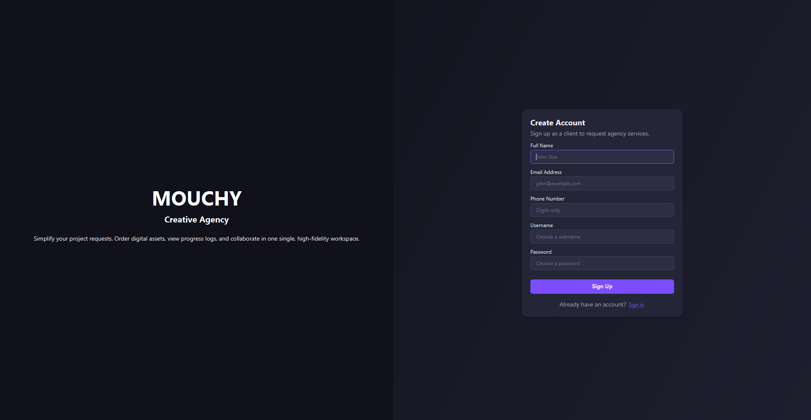
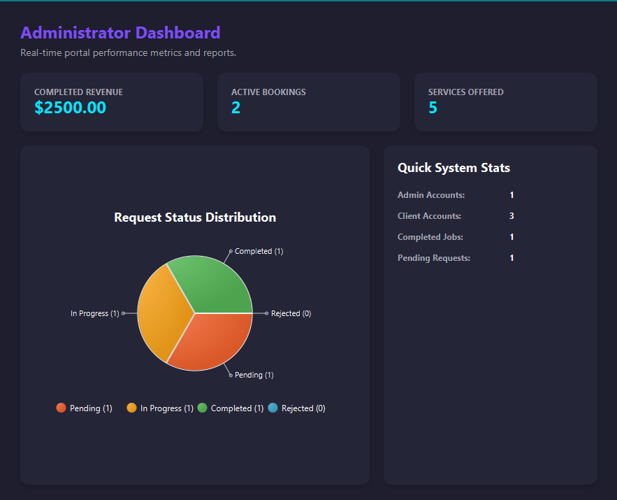
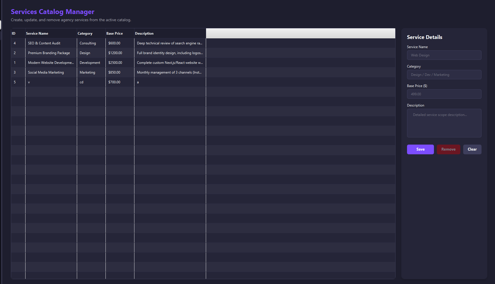
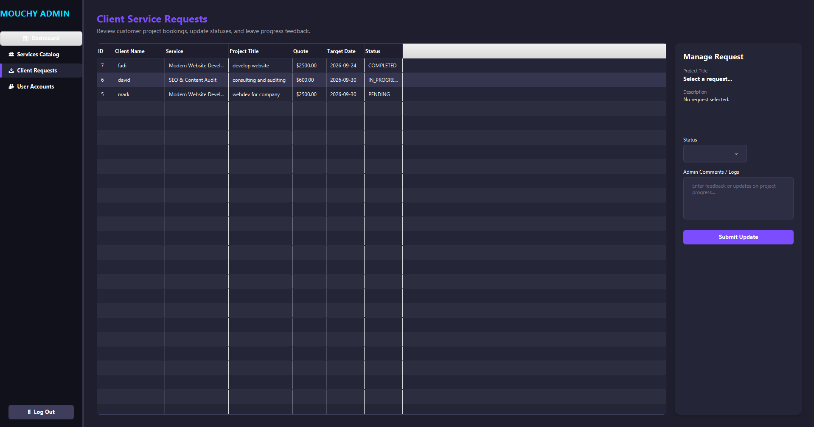
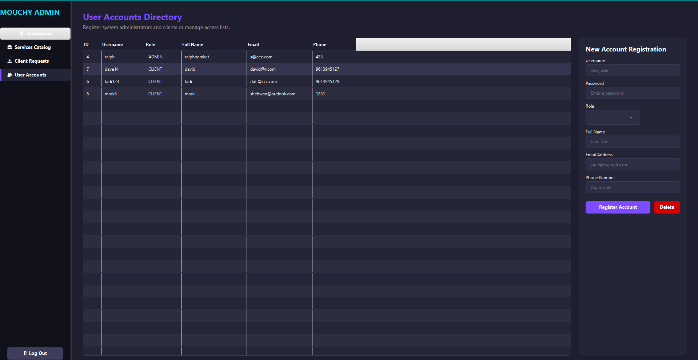
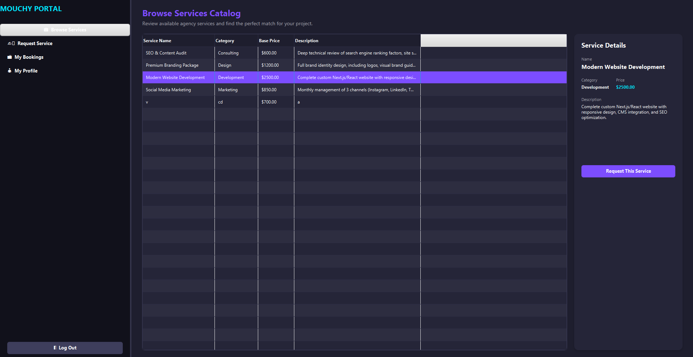
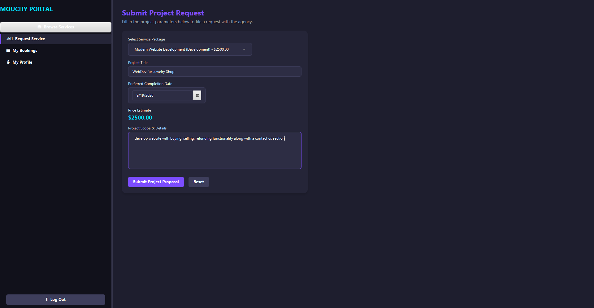

# Service Management UI

UI for software/graphic design service management

## Features

Client-side:
- Client registration and authentication
- Role-based admin and client interfaces
- Browse and request available services
- Track project requests and booking status
- Client profile management
- PDF export of client profile and booking history

Admin-side:
- Admin management of services, users and client requests
- Admin dashboard with booking and revenue statistics
- Admin comments and project status updates

Database:
- Automatic local database initialization
- SQLite local persistence

## Tech Stack

- Java 21
- JavaFX 21
- SQLite
- Maven
- SQLite JDBC
- OpenPDF
- FXML
- CSS

## Application

### Login and Registration

### Admin: Dashboard

### Admin: Creating and Deleting requestable services

  

### Admin: Managing Service Requests

### Admin: Managing client accounts

### Client: Requesting a service

